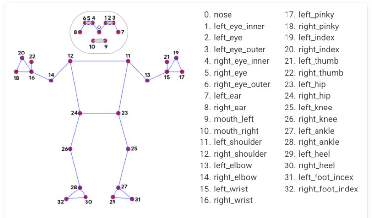

# Journal
В первый день я определилась с темой своего проекта. Я решила выбрать тему счетчика отжиманий, так как мне было сразу понятно, как эту программу осуществлять.
Также этот проект будет полезным, он отслеживает правильность техники отжиманий и не позволяет сделать упражнение не в полной мере.
## Цель
Создать программу, которая считает количество отжиманий, которые делает человек.
## Создание кода
В следующие дни я начала писать код самой программы. Он получился небольшим - 77 строк. 
В первую очередь, стояла задача считать изображение с камеры. Это осуществлялось с помощью библиотеки opencv. Далее, используя mediapipe, определялись координаты позы человека.\
 \
Также я создала переменную moment_position, которая фиксировала положение человека (внизу или наверху) во время отжиманий. Это помогло избежать пробелемы бесконечного счетчика, когда человек просто находится наверху и не выполняет отжимания. 
